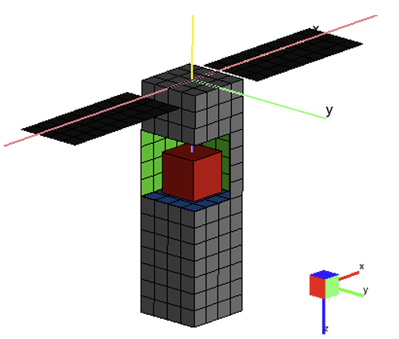
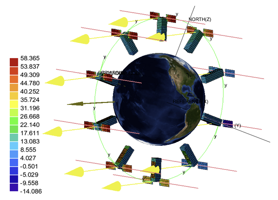
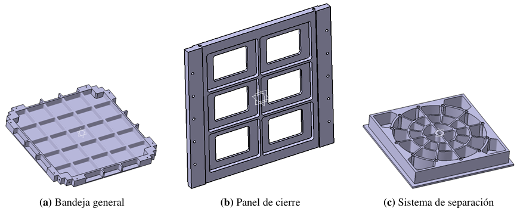
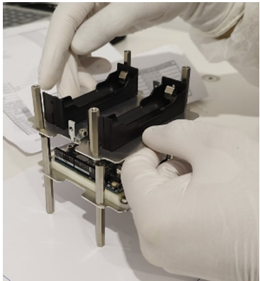
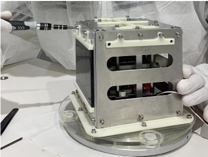
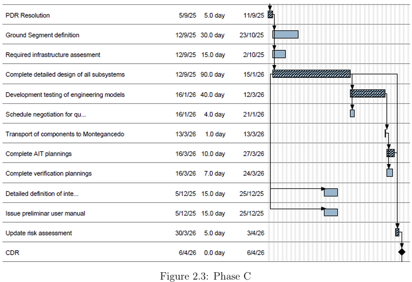
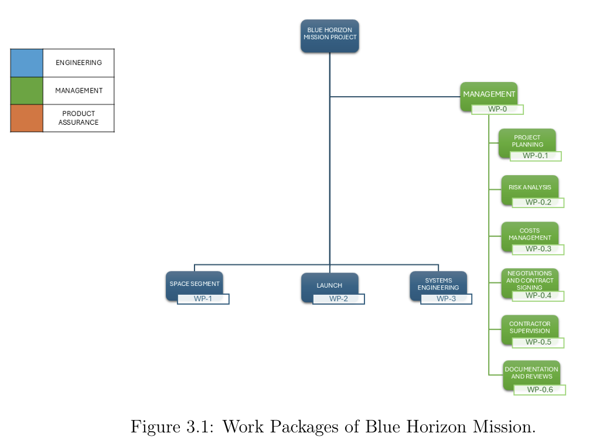
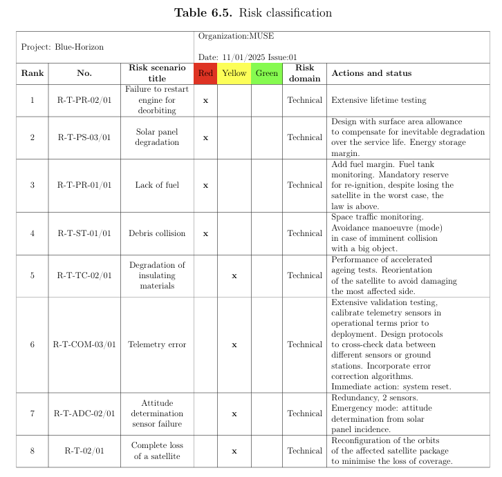

# Space-Engineering-Portfolio
Selected space engineering projects in structural analysis, spacecraft mechanical design, thermal engineering, systems engineering and AIT, developed during the MSc in Space Systems at UPM using MSC Patran/Nastran, CAD software, ESATAN-TMS, MATLAB and Python.

## Featured projects: 
1. [Spacecraft Structural Analysis — MSC Patran/Nastran](https://github.com/jorge-morenog/Space-Engineering-Portfolio/blob/main/structural-analysis/TP3_STR_FEM_Satellite.pdf)  
FEM modelling, modal/quasi-static/vibration analysis, model verification.

  
  
  

2. [3U CubeSat Thermal Design — ESATAN-TMS](https://github.com/jorge-morenog/Space-Engineering-Portfolio/blob/main/thermal-engineering/2_THERM_ESATAN-TMS.pdf)  
Orbital environment, thermal mathematical model, hot/cold cases.

  
  

3. [Parametric & Modular Spacecraft CAD](https://github.com/jorge-morenog/Space-Engineering-Portfolio/blob/main/mechanical-design-ait/T1_CAD_Parametric_Satellite_Tray.pdf)  
Parametric trays, modular architecture, harness routing and interfaces.

  
  

4. [Assembly, Integration & Vibration Testing — ECSS](https://github.com/jorge-morenog/Space-Engineering-Portfolio/tree/main/mechanical-design-ait/assembly-integration-testing)  
Assembly planning, sinusoidal/random vibration testing and FEM-test correlation.

  
  

5. [Space Systems Engineering — Project Management, Risks and Preliminary Mission Design](./systems-engineering/)
   Requirements, system architecture, preliminary design and subsystem trade-offs.

  
  
  

> These projects were developed in an academic context as part of the MSc in Space Systems. Some were completed individually and others as team projects.
