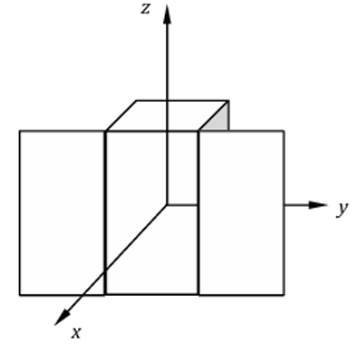
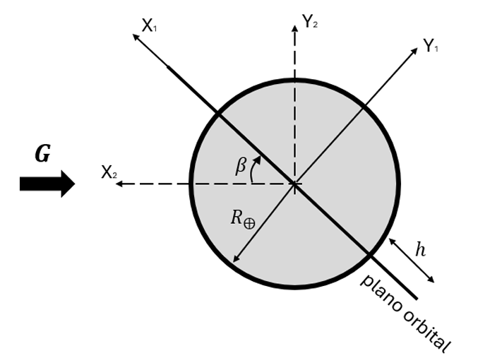
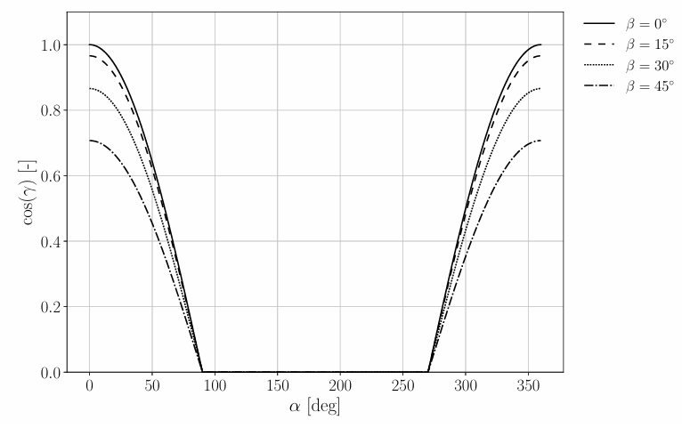
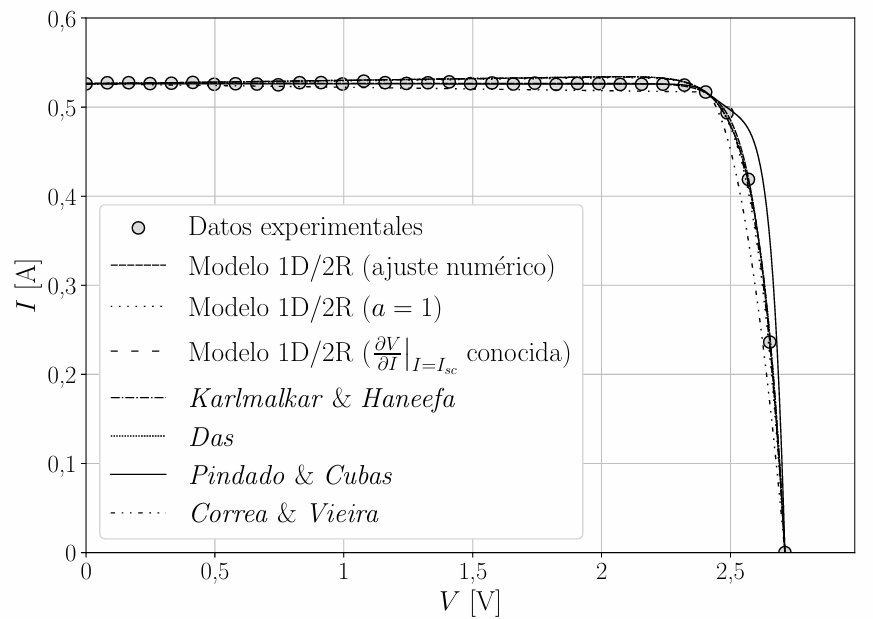
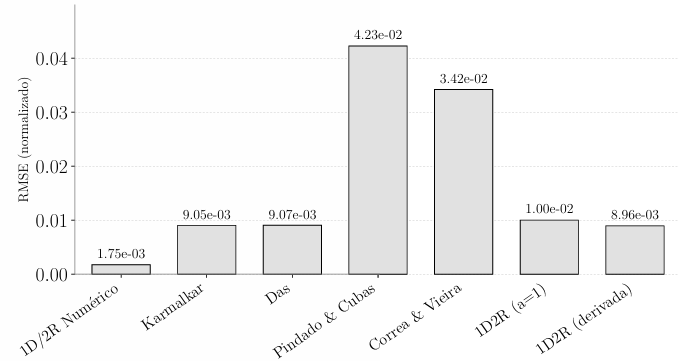
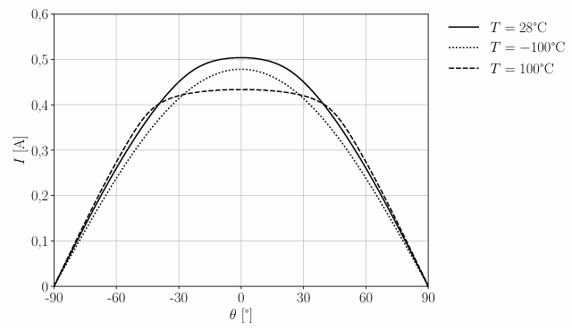
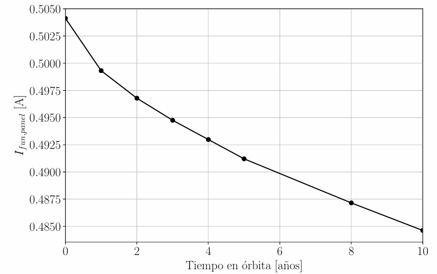

# Spacecraft Electrical Power Systems

This section presents selected projects related to spacecraft electrical power generation and solar-array performance, developed during the MSc in Space Systems at UPM.

The projects cover orbital solar-energy availability, photovoltaic power generation, spacecraft attitude effects, eclipse conditions, solar-cell electrical modelling, panel operating-point analysis and in-orbit performance degradation.

The work combines analytical modelling, numerical methods, experimental-data fitting and parametric studies using Python and MATLAB.

## Projects

### [Solar Power Generation in Sun-Synchronous LEO](https://github.com/jorge-morenog/Space-Engineering-Portfolio/blob/main/electrical-power-systems/GGE_T1_Power_Generation_in_Orbit.pdf)

Analysis of the power and energy generated by the solar arrays of a 12U CubeSat in a Sun-synchronous low-Earth orbit.

The study compares two spacecraft attitude strategies: solar arrays continuously oriented toward zenith and solar arrays continuously pointed toward the Sun using an attitude determination and control system. The effects of orbital altitude, beta angle, eclipse duration and solar-cell packing factor are evaluated through analytical and parametric models.

   
  
  

### [Triple-Junction Solar-Cell Modelling and In-Orbit Degradation](https://github.com/jorge-morenog/Space-Engineering-Portfolio/blob/main/electrical-power-systems/GGE_T2_TJCells_IV_Modelling_Degradation.pdf)

Comparative modelling of an Azur Space 3G30C triple-junction solar cell using numerical and analytical current–voltage models.

The project includes experimental-data fitting, comparison of several photovoltaic models, normalized RMSE evaluation, computational-performance assessment, panel operating-point analysis under different temperatures and incidence angles, and estimation of in-orbit degradation over the mission lifetime.

  
  

  
  

## Main Topics

- Spacecraft solar-array power generation
- Sun-synchronous orbital environment
- Eclipse and beta-angle analysis
- Spacecraft attitude and solar incidence
- Triple-junction solar-cell modelling
- Current–voltage curve fitting
- Maximum-power and operating-point analysis
- Temperature and incidence-angle effects
- In-orbit photovoltaic degradation
- Numerical optimization and model validation

## Tools and Methods

- Python
- MATLAB
- SciPy
- Analytical modelling
- Nonlinear least-squares fitting
- Experimental-data comparison
- Parametric analysis
- Error and computational-performance assessment

> These projects were developed in an academic context as part of the MSc in Space Systems at UPM.
