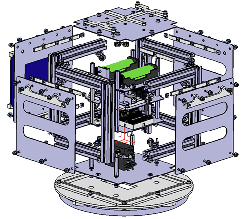
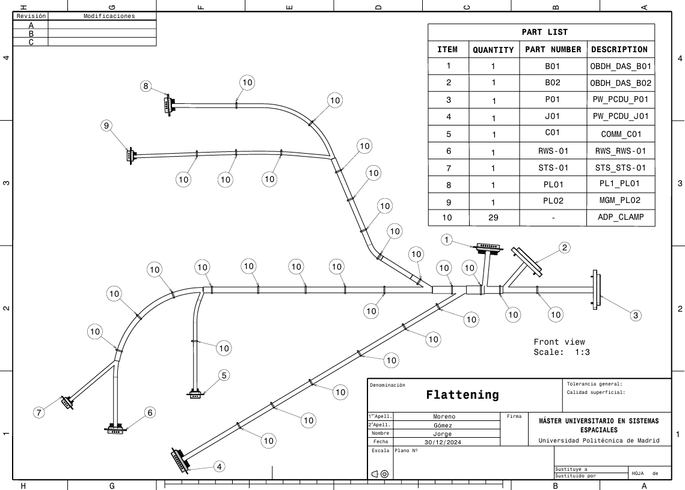

# Spacecraft Mechanical Design and AIT

This section presents selected projects related to spacecraft mechanical design, equipment integration and Assembly, Integration and Testing activities.

The projects cover parametric CAD design, modular spacecraft architecture, equipment accommodation, harness routing, assembly planning, physical integration and qualification-level mechanical testing.

The work includes mechanical interface definition, manufacturability, cleanliness practices, step-by-step assembly documentation, sinusoidal and random vibration test preparation, instrumentation definition and correlation between finite element models and physical tests.

## Projects

### [Assembly, Integration and Testing](./assembly-integration-testing/)

  
  
  

### [Parametric Satellite Tray Design](https://github.com/jorge-morenog/Space-Engineering-Portfolio/blob/main/mechanical-design-ait/T1_CAD_Parametric_Satellite_Tray.pdf),  

  

### [Modular Microsatellite Mechanical Design](T3_IGA_Modular_Satellite_UnitD.pdf)  

Parametric CAD design of a modular microsatellite structure with configurable geometry and launcher interface.

- Modular trays, shear panels, closing panels and separators
- Parametric square/hexagonal configurations
- Equipment accommodation and mechanical interfaces
- CarboNIX C8 separation-system adapter

### [Satellite Harness Routing](https://github.com/jorge-morenog/Space-Engineering-Portfolio/blob/main/mechanical-design-ait/T2_CAD_Satellite_Harness_Routing.pdf).  

  
  

> These projects were developed in an academic context as part of the MSc in Space Systems. Some were completed individually and others as team projects.

