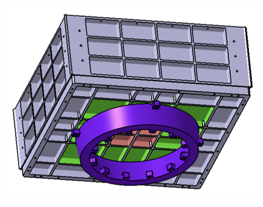
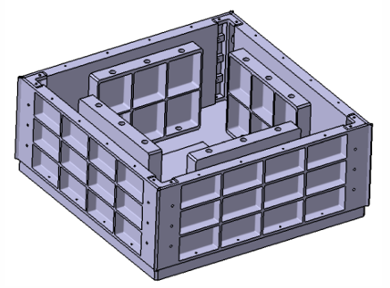
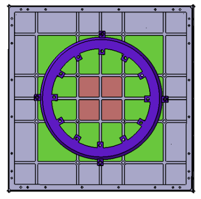
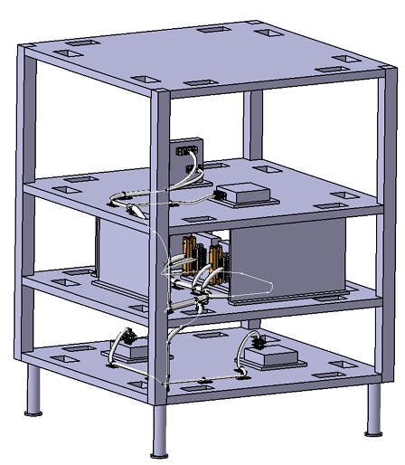

# Spacecraft Mechanical Design and AIT

Selected projects in spacecraft mechanical design, parametric CAD, equipment integration and Assembly, Integration and Testing, developed during the MSc in Space Systems at UPM.

## Projects

### [Assembly, Integration and Testing](./assembly-integration-testing/)

Spacecraft assembly, integration and qualification-level mechanical testing.

  
  
  

### [Modular Microsatellite Mechanical Design](./T3_IGA_Modular_Satellite_UnitD.pdf)

Parametric CAD design of a modular microsatellite structure with configurable geometry and launcher interface.

- Modular trays, shear panels, closing panels and separators
- Parametric square and hexagonal configurations
- Equipment accommodation and mechanical interfaces
- CarboNIX C8 separation-system adapter

  
  
  

### [Parametric Satellite Tray Design](./T1_CAD_Parametric_Satellite_Tray.pdf)

Parametric spacecraft tray design with configurable geometry, stiffening layout and equipment accommodation.

  

### [Satellite Harness Routing](./T2_CAD_Satellite_Harness_Routing.pdf)

CATIA V5 harness integration including connector definition, 3D routing and manufacturing flattening.

  
  

> Academic projects developed as part of the MSc in Space Systems at UPM. Some were completed individually and others as team projects.
