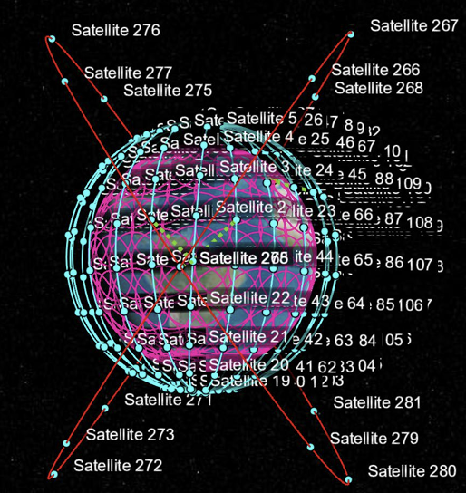
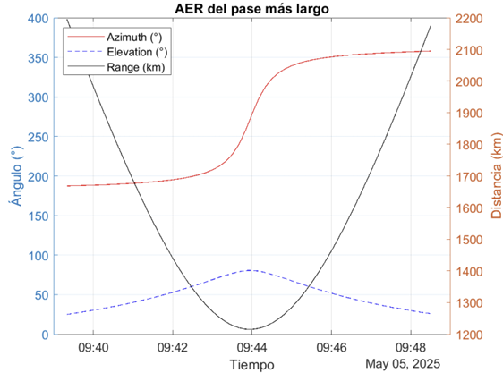
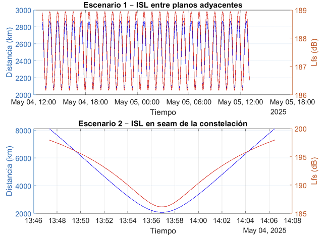
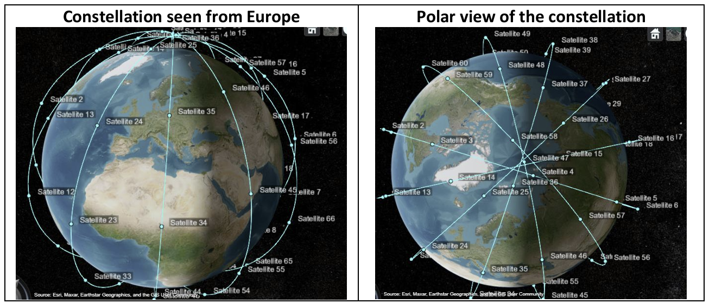
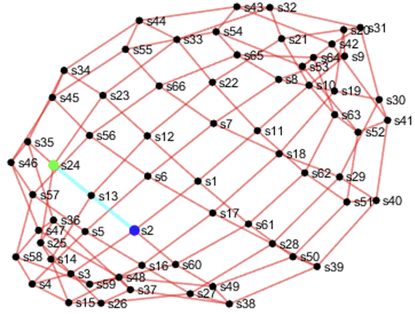
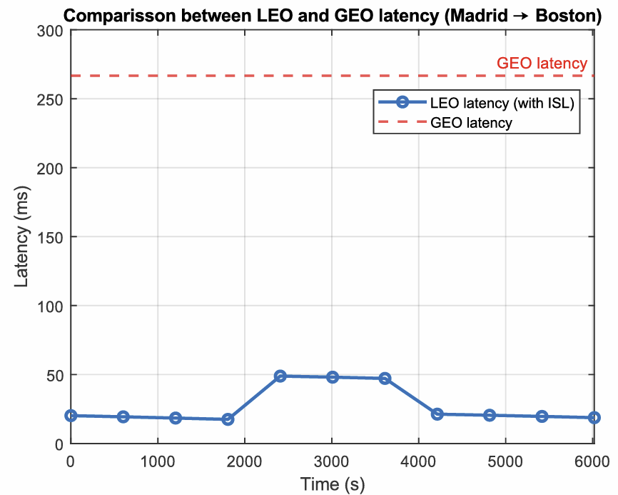
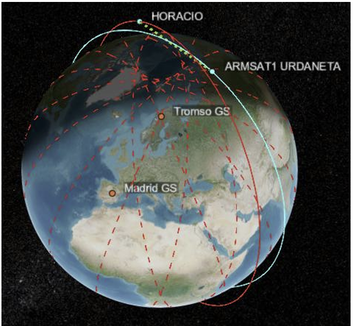
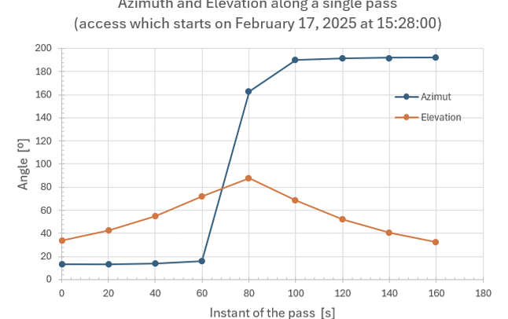
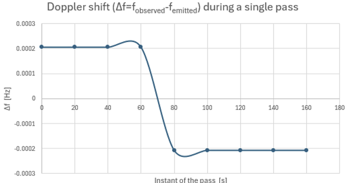

# Satellite Communications and Constellation Analysis

Selected projects in satellite communications, orbital analysis and constellation networking, developed during the MSc in Space Systems at UPM using MATLAB and the Satellite Communications Toolbox.

## Projects

### LEO–MEO Satellite Communications and Adaptive Coding & Modulation

Analysis of a multi-orbit LEO–MEO communication architecture inspired by IRIS².

- Ka-band link budget and access analysis
- Adaptive Coding and Modulation (ACM)
- LEO–LEO and LEO–MEO inter-satellite links
- EIRP, G/T, throughput and system-level trade-offs

  
  
  

### Satellite Constellation Routing and Inter-Satellite Link Analysis

Design and analysis of a Walker Star constellation with dynamic ground and inter-satellite communications.

- Walker constellation and ground-station access
- Intra-plane and inter-plane ISL topology
- Graph-based shortest-path routing
- End-to-end latency and LEO–GEO comparison

  
  
  

### Satellite Orbit, Ground Access and Link Dynamics Analysis

Orbital and communications analysis of an Earth-observation CubeSat using real TLE data.

- Orbit propagation and ground-station visibility
- Access duration and data-download capacity
- AER, free-space losses and latency
- Doppler-shift analysis

  
  
  

## Tools

MATLAB · Satellite Communications Toolbox · TLE/Keplerian propagation · Link-budget analysis · Graph-based routing · ACM

> These projects were developed in an academic context as part of the MSc in Space Systems. Some were completed individually and others as team projects.
