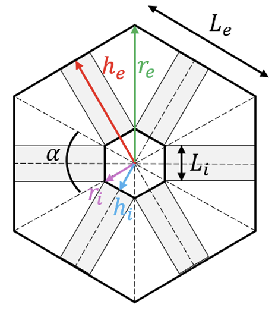
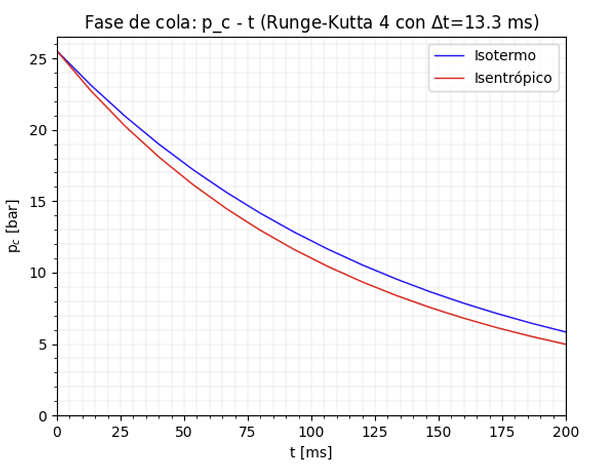
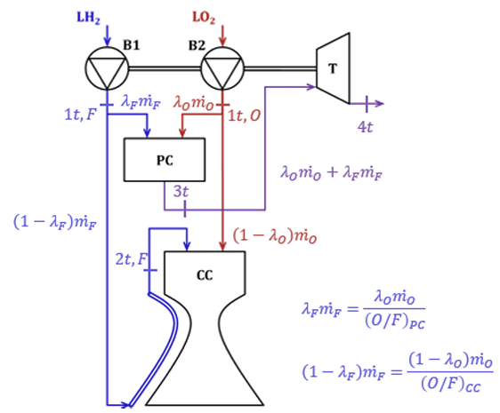
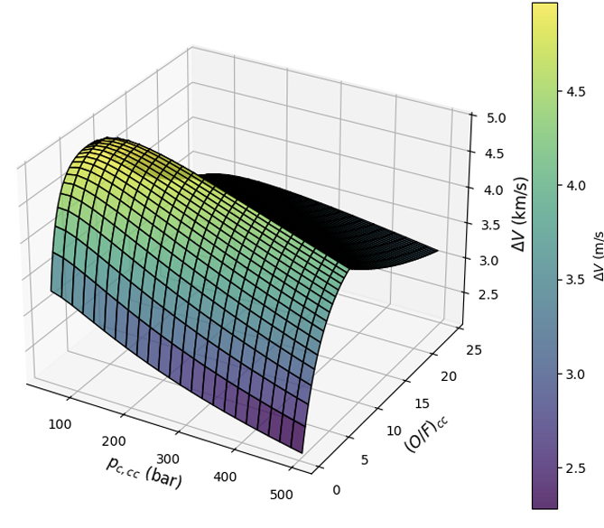
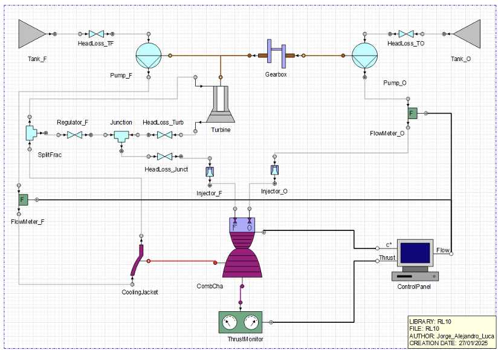

# Space Propulsion Systems

This section presents selected projects in chemical and electric space propulsion developed during the MSc in Space Systems at UPM.

The projects cover solid rocket motor performance, liquid rocket engine cycle analysis, pressure-fed propulsion systems, propulsion system modelling with PROOSIS, and electrostatic propulsion for orbital transfer applications.

The work includes analytical modelling, thermodynamic cycle analysis, combustion calculations, turbomachinery power balance, nozzle sizing, propellant selection, pressure-fed system design, off-design performance assessment and propulsion system optimization.

## Projects

- [Solid Rocket Motor Performance Analysis](https://github.com/jorge-morenog/Space-Engineering-Portfolio/blob/main/space-propulsion/T1_Rocket_Engine_Solid_Propellant.pdf)

  
  

- [Gas-Generator Liquid Rocket Engine Cycle Optimization](https://github.com/jorge-morenog/Space-Engineering-Portfolio/blob/main/space-propulsion/T2_Rocket_Engine_Liquid_Propellant-Turbo.pdf)

  
  

- [Pressure-Fed Hydrazine Propulsion System](https://github.com/jorge-morenog/Space-Engineering-Portfolio/blob/main/space-propulsion/T3_Rocket_Engine_Liquid_Propellant-Pressurized.pdf)
- [RL10 Performance and Off-Design Analysis Using PROOSIS](https://github.com/jorge-morenog/Space-Engineering-Portfolio/blob/main/space-propulsion/T4_Rocket_Engine_Liquid_Propellant-PROOSIS.pdf)

  

- [Electrostatic Propulsion System for LEO-to-GEO Transfer](https://github.com/jorge-morenog/Space-Engineering-Portfolio/blob/main/space-propulsion/T5_Rocket_Engine_Electrostatic.pdf)

## Main Topics

- Solid propellant grain regression and thrust evolution
- Liquid rocket engine cycle modelling
- Turbopump and turbine power balance
- Nozzle throat sizing and propulsion performance
- Pressure-fed tank and pressurization system design
- Design-point and off-design simulation using PROOSIS
- Electric propulsion sizing and propellant trade-offs
- Orbital transfer and launch-cost optimization

## Tools and Methods

- Python
- MATLAB
- PROOSIS / LPRES
- Thermodynamic cycle analysis
- Rocket performance equations
- Parametric studies and engineering trade-offs

> These projects were developed in an academic context as part of the MSc in Space Systems. Some were completed individually and others as team projects.
