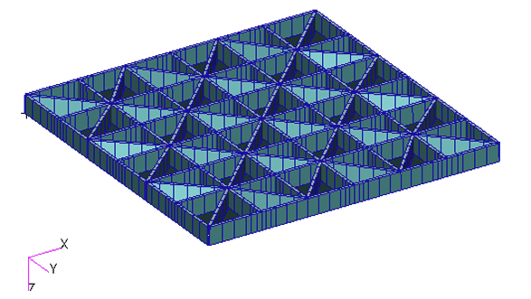
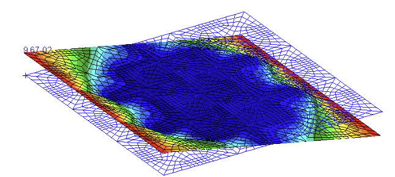
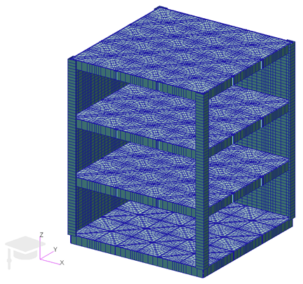
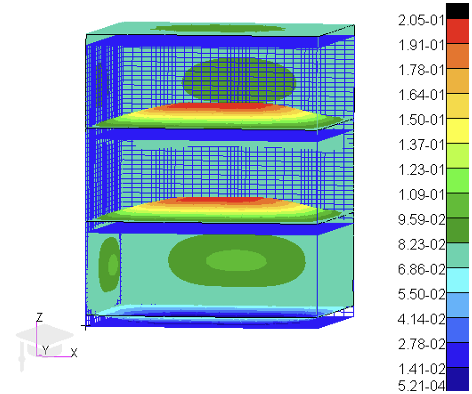
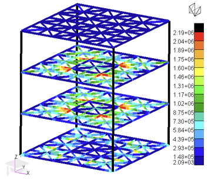

# Structural Analysis

This section presents selected projects in spacecraft structural analysis, finite element modelling and structural dynamics.

The projects include FEM validation against analytical solutions, minimum-mass structural optimization, complete microsatellite modelling, modal reduction using the Craig–Bampton method, and high-frequency vibroacoustic analysis using Statistical Energy Analysis.

The work was developed mainly using MSC Patran/Nastran, MATLAB and Python, with particular emphasis on model verification, modal behaviour, margins of safety, quasi-static loads, sinusoidal vibration and random vibration environments.

## Projects

- [FEM Validation Against Analytical Models](https://github.com/jorge-morenog/Space-Engineering-Portfolio/blob/main/structural-analysis/TP1_STR_FEM_Some_Typical_Analysis.pdf),  

- [Minimum-Mass Satellite Tray Optimization](https://github.com/jorge-morenog/Space-Engineering-Portfolio/blob/main/structural-analysis/TP2_STR_FEM_Optimal_Tray.pdf),  

  
  

- [Microsatellite FEM Structural Analysis](https://github.com/jorge-morenog/Space-Engineering-Portfolio/blob/main/structural-analysis/TP3_STR_FEM_Satellite.pdf),  

  
  
  

- [Craig–Bampton Component Mode Synthesis](https://github.com/jorge-morenog/Space-Engineering-Portfolio/blob/main/structural-analysis/TT1_STR_Craig_Bampton.pdf),  
- [Vibroacoustic Analysis Using SEA](https://github.com/jorge-morenog/Space-Engineering-Portfolio/blob/main/structural-analysis/TT2_STR_Vibroacoustics.pdf).  

> These projects were developed in an academic context as part of the MSc in Space Systems. Some were completed individually and others as team projects.
