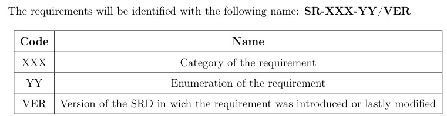
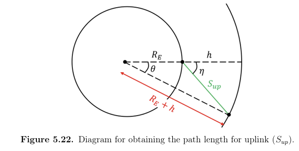
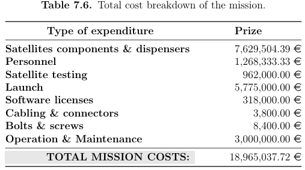

# Systems Engineering

This section contains selected projects related to space systems engineering and preliminary mission design.

The projects cover mission-level and subsystem requirements, system architecture, preliminary spacecraft design, mission analysis, work breakdown structures, project scheduling, risk assessment, cost estimation and subsystem-level trade-offs.

These activities were developed as multidisciplinary team projects within the MSc in Space Systems, following a structured engineering approach based on requirements, lifecycle phases, technical reviews and subsystem integration.

## Projects

- [BlueHorizon Systems Requirements Definition](https://github.com/jorge-morenog/Space-Engineering-Portfolio/blob/main/systems-engineering/T1_ISG_System_Requirements_Document.pdf),  

  

- [BlueHorizon Project Planning and Work Breakdown Structure](https://github.com/jorge-morenog/Space-Engineering-Portfolio/blob/main/systems-engineering/T2_ISG_Work_Breakdown_Structure_%26_Gantt.pdf),  

  
  

- [BlueHorizon Preliminary Mission and Spacecraft Design](https://github.com/jorge-morenog/Space-Engineering-Portfolio/blob/main/systems-engineering/T3_ISG_Preliminary_Mission_Design.pdf).  

  
  
  

> These projects were developed in an academic context as part of the MSc in Space Systems. Some were completed individually and others as team projects.
