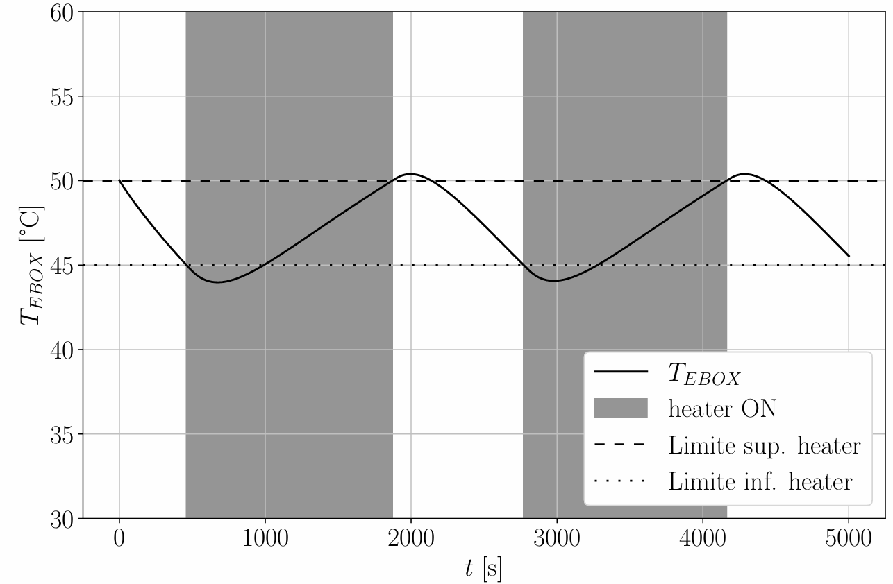
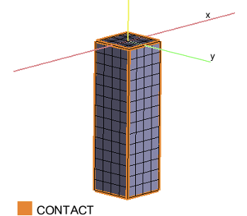

# Thermal Engineering

This section presents selected projects in spacecraft heat transfer and thermal control.

The projects include analytical and numerical thermal modelling, radiator sizing, steady-state and transient heat transfer, thermostat-controlled heaters, orbital thermal environment definition and complete spacecraft thermal modelling using ESATAN-TMS.

The work was developed using ESATAN-TMS, MATLAB and Python, with emphasis on thermal balance, conduction, radiation, thermal interfaces, passive thermal control and hot and cold worst-case assessment.

## Projects

- [EBOX–Radiator Thermal Analysis](https://github.com/jorge-morenog/Space-Engineering-Portfolio/blob/main/thermal-engineering/1_THERM_Conduction.pdf),  

  

- [CubeSat 3U Thermal Design Using ESATAN-TMS](https://github.com/jorge-morenog/Space-Engineering-Portfolio/blob/main/thermal-engineering/2_THERM_ESATAN-TMS.pdf).  

  
  
  

